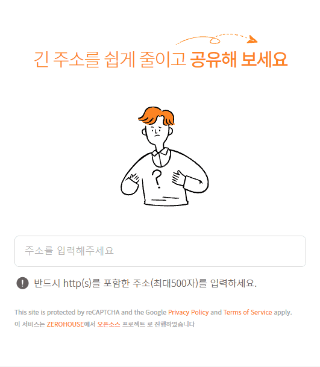

# [to2.kr](https://to2.kr)

TO2는 긴 주소를 짧게 줄여주는 서비스입니다.

  

## 설정

### Configuration Profile

본 프로젝트에서 정의하는 configuration profile은 아래와 같습니다.

- **dev**: 개발용
- **prod**: 배포용

### External Application Configuration

소스코드 내부에 민감정보를 포함시키지 않기 위해서 [features.external-config.files.wildcard-locations](https://docs.spring.io/spring-boot/docs/2.5.x/reference/html/features.html#features.external-config.files.wildcard-locations) 기능을 사용하여 설정을 관리합니다.

정상적인 개발과 배포를 위해서 개발시에는 `project-root/config`에 그리고 배포시에는 `jar-directory/config`에 아래의 파일을 생성하기 바랍니다.

- config/recaptcha/application.yml
- config/google-analytics/application.yml

`config/<config-name>/application.yml`의 `<config-name>`에 해당하는 설정이 `src/main/resources/application.yml`에 샘플로 빈값 또는 기본값이 설정돼 있습니다. 이에 맞게 파일을 작성하면 됩니다.

## 개발환경

본 프로젝트의 개발환경은 `vscode`의 `devcontainer`를 사용합니다.

## 디자인

본 프로젝트의 디자인은 [nalong](https://nalong.studio)이 하였습니다.

## License

to2.kr-server는 [Apache License, Version 2.0](./LICENSE)를 적용합니다.
